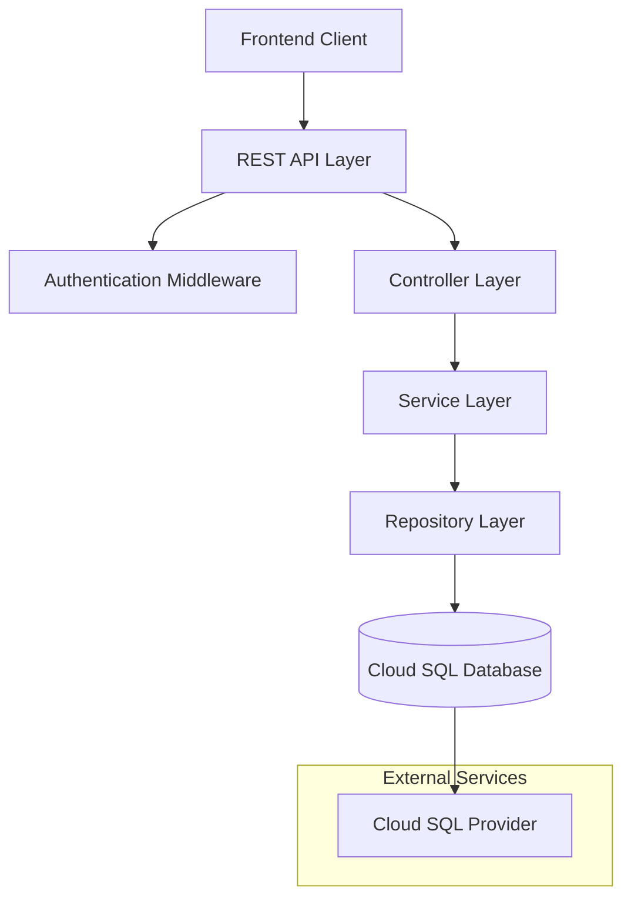
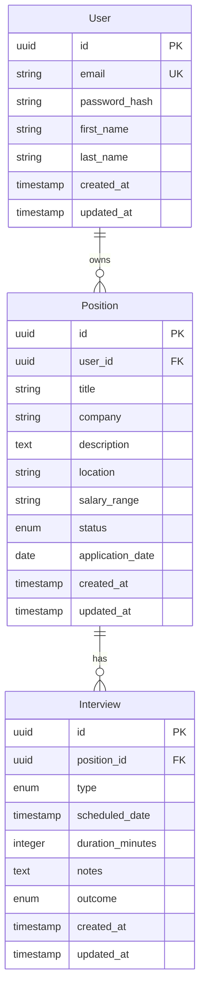

# Design Document

## Overview

The Interview Position Tracker API is a RESTful backend service that enables job seekers to manage their job applications, track interview progress, and analyze application statistics. The system follows a layered architecture with clear separation of concerns, utilizing a cloud SQL database for data persistence and providing secure, scalable endpoints for frontend consumption.

## Architecture

### System Architecture



### Technology Stack

- **Framework**: FastAPI (Python) for high-performance async API with automatic documentation
- **Language**: Python 3.9+ for rapid development and excellent library ecosystem
- **Database**: PostgreSQL (recommended cloud providers: Supabase, PlanetScale, or AWS RDS free tier)
- **Authentication**: JWT tokens with passlib for password hashing
- **Validation**: Pydantic models (built into FastAPI) for request/response validation
- **ORM**: SQLAlchemy with Alembic for database operations and migrations
- **Testing**: pytest for unit and integration tests
- **Statistics**: pandas for data analysis and statistics calculations

### Cloud Database Recommendations

1. **Supabase** (PostgreSQL) - 500MB free tier, built-in auth
2. **PlanetScale** (MySQL) - 1GB free tier, serverless scaling
3. **AWS RDS Free Tier** - 20GB PostgreSQL/MySQL, 12 months free
4. **Google Cloud SQL** - $300 credit for new users

## Components and Interfaces

### API Endpoints

#### Authentication Endpoints
- `POST /api/auth/register` - User registration
- `POST /api/auth/login` - User authentication
- `POST /api/auth/refresh` - Token refresh

#### Position Management Endpoints
- `GET /api/positions` - List user's positions (with filtering and pagination)
- `POST /api/positions` - Create new position
- `GET /api/positions/:id` - Get specific position details
- `PUT /api/positions/:id` - Update position
- `DELETE /api/positions/:id` - Delete position

#### Interview Stage Endpoints
- `GET /api/positions/:id/interviews` - List interviews for position
- `POST /api/positions/:id/interviews` - Add interview stage
- `PUT /api/interviews/:id` - Update interview stage
- `DELETE /api/interviews/:id` - Delete interview stage

#### Statistics Endpoints
- `GET /api/statistics/overview` - General statistics
- `GET /api/statistics/timeline` - Time-based statistics
- `GET /api/statistics/companies` - Company-based statistics

### Request/Response Formats

#### Pydantic Models

```python
from pydantic import BaseModel, UUID4
from datetime import datetime, date
from enum import Enum
from typing import Optional, List

class PositionStatus(str, Enum):
    APPLIED = "applied"
    SCREENING = "screening"
    INTERVIEWING = "interviewing"
    OFFER = "offer"
    REJECTED = "rejected"
    WITHDRAWN = "withdrawn"

class InterviewType(str, Enum):
    PHONE = "phone"
    VIDEO = "video"
    ONSITE = "onsite"
    TECHNICAL = "technical"
    BEHAVIORAL = "behavioral"
    FINAL = "final"

class InterviewOutcome(str, Enum):
    PENDING = "pending"
    PASSED = "passed"
    FAILED = "failed"
    CANCELLED = "cancelled"

class PositionBase(BaseModel):
    title: str
    company: str
    description: Optional[str] = None
    location: Optional[str] = None
    salary_range: Optional[str] = None
    status: PositionStatus = PositionStatus.APPLIED
    application_date: date

class PositionCreate(PositionBase):
    pass

class PositionResponse(PositionBase):
    id: UUID4
    created_at: datetime
    updated_at: datetime
    interviews: List['InterviewResponse'] = []

class InterviewBase(BaseModel):
    type: InterviewType
    scheduled_date: datetime
    duration_minutes: Optional[int] = None
    notes: Optional[str] = None
    outcome: InterviewOutcome = InterviewOutcome.PENDING

class InterviewCreate(InterviewBase):
    pass

class InterviewResponse(InterviewBase):
    id: UUID4
    position_id: UUID4
    created_at: datetime
    updated_at: datetime
```

## Data Models

### Database Schema

```sql
-- Users table
CREATE TABLE users (
    id UUID PRIMARY KEY DEFAULT gen_random_uuid(),
    email VARCHAR(255) UNIQUE NOT NULL,
    password_hash VARCHAR(255) NOT NULL,
    first_name VARCHAR(100),
    last_name VARCHAR(100),
    created_at TIMESTAMP DEFAULT CURRENT_TIMESTAMP,
    updated_at TIMESTAMP DEFAULT CURRENT_TIMESTAMP
);

-- Positions table
CREATE TABLE positions (
    id UUID PRIMARY KEY DEFAULT gen_random_uuid(),
    user_id UUID NOT NULL REFERENCES users(id) ON DELETE CASCADE,
    title VARCHAR(255) NOT NULL,
    company VARCHAR(255) NOT NULL,
    description TEXT,
    location VARCHAR(255),
    salary_range VARCHAR(100),
    status VARCHAR(50) DEFAULT 'applied' CHECK (status IN ('applied', 'screening', 'interviewing', 'offer', 'rejected', 'withdrawn')),
    application_date DATE NOT NULL,
    created_at TIMESTAMP DEFAULT CURRENT_TIMESTAMP,
    updated_at TIMESTAMP DEFAULT CURRENT_TIMESTAMP
);

-- Interviews table
CREATE TABLE interviews (
    id UUID PRIMARY KEY DEFAULT gen_random_uuid(),
    position_id UUID NOT NULL REFERENCES positions(id) ON DELETE CASCADE,
    type VARCHAR(50) NOT NULL CHECK (type IN ('phone', 'video', 'onsite', 'technical', 'behavioral', 'final')),
    scheduled_date TIMESTAMP NOT NULL,
    duration_minutes INTEGER,
    notes TEXT,
    outcome VARCHAR(50) DEFAULT 'pending' CHECK (outcome IN ('pending', 'passed', 'failed', 'cancelled')),
    created_at TIMESTAMP DEFAULT CURRENT_TIMESTAMP,
    updated_at TIMESTAMP DEFAULT CURRENT_TIMESTAMP
);

-- Indexes for performance
CREATE INDEX idx_positions_user_id ON positions(user_id);
CREATE INDEX idx_positions_status ON positions(status);
CREATE INDEX idx_positions_application_date ON positions(application_date);
CREATE INDEX idx_interviews_position_id ON interviews(position_id);
CREATE INDEX idx_interviews_scheduled_date ON interviews(scheduled_date);
```

### Entity Relationships



## Error Handling

### Error Response Format
```json
{
  "error": {
    "code": "ERROR_CODE",
    "message": "Human readable error message",
    "details": "Additional error details or validation errors",
    "timestamp": "ISO 8601 datetime"
  }
}
```

### HTTP Status Codes
- `200 OK` - Successful GET, PUT requests
- `201 Created` - Successful POST requests
- `204 No Content` - Successful DELETE requests
- `400 Bad Request` - Invalid request data or validation errors
- `401 Unauthorized` - Missing or invalid authentication
- `403 Forbidden` - Insufficient permissions
- `404 Not Found` - Resource not found
- `409 Conflict` - Resource conflict (e.g., duplicate email)
- `422 Unprocessable Entity` - Validation errors
- `500 Internal Server Error` - Server errors

### Error Handling Strategy
1. **Validation Errors**: Use middleware to validate requests and return detailed field-level errors
2. **Database Errors**: Catch and transform database errors into user-friendly messages
3. **Authentication Errors**: Provide clear but secure error messages for auth failures
4. **Logging**: Log all errors with appropriate detail levels for debugging
5. **Rate Limiting**: Implement rate limiting to prevent abuse

## Testing Strategy

### Unit Testing
- **Controllers**: Test request/response handling and validation
- **Services**: Test business logic and data transformations
- **Repositories**: Test database operations with mocked connections
- **Utilities**: Test helper functions and middleware

### Integration Testing
- **API Endpoints**: Test complete request/response cycles
- **Database Operations**: Test with test database instances
- **Authentication Flow**: Test JWT generation and validation
- **Error Scenarios**: Test error handling and edge cases

### Test Data Management
- Use factories or fixtures for consistent test data
- Implement database seeding for integration tests
- Clean up test data after each test run
- Use separate test database instances

### Performance Testing
- Load testing for concurrent users
- Database query performance testing
- Memory usage monitoring
- Response time benchmarking

### Security Testing
- Authentication bypass attempts
- SQL injection prevention
- Input validation testing
- Rate limiting verification